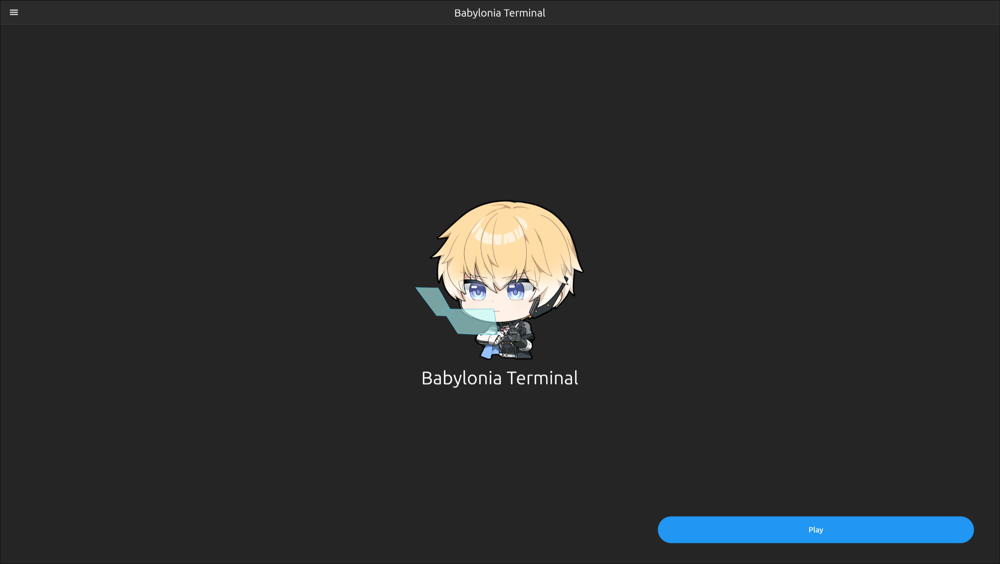
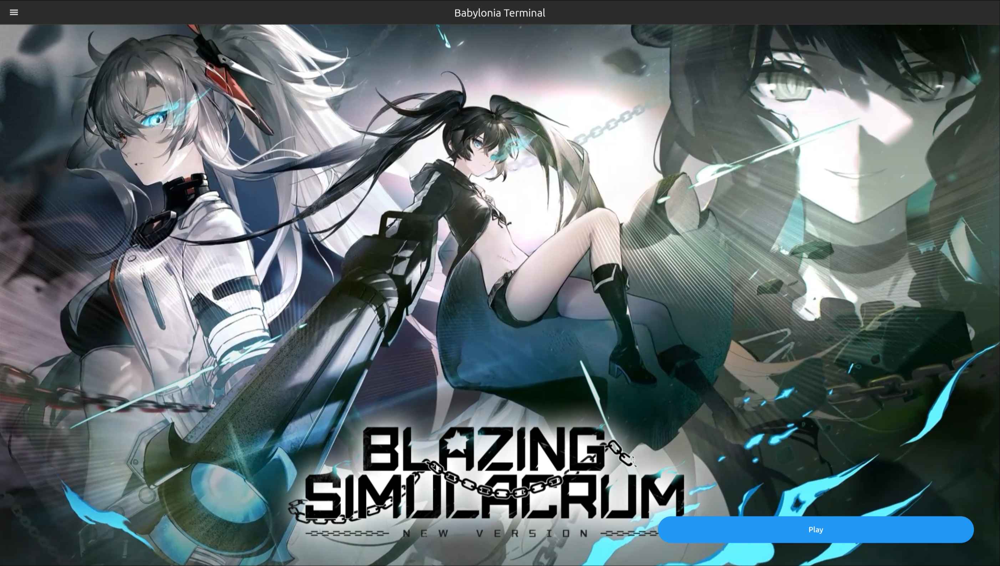
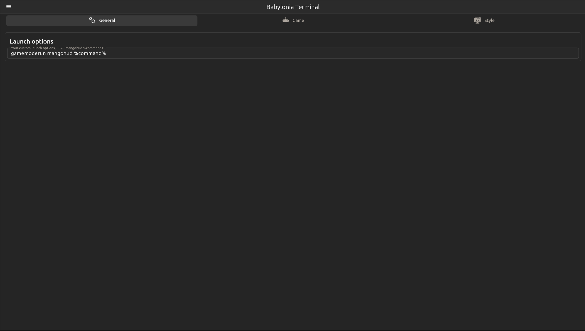

<p align="center">
    <br>
</p>

<div align="center">
    <h1>Babylonia Terminal</h1>
</div>

### This launcher download, install your favorite anime game and it's dependencies for you!
For now, there is only a cli version of the launcher, but a gui one is on my radar, so stay tuned!  
If you have any issue with the launcher, don't hesitate to open an [issue](https://github.com/ALEZ-DEV/Babylonia-terminal/issues)!

## GUI Version
<details>
    <summary>Screenshot</summary>
    <br>
    <br>
    <br>
</details>

The GUI version is now usable but not totally stable and lack of some functionnality, but you can try to [compile it](https://github.com/ALEZ-DEV/Babylonia-terminal/tree/master/babylonia_terminal_launcher) (A pre compiled binary will be soon distributed)  
Be aware this version can have some bugs, don't hesitate to open an [issue](https://github.com/ALEZ-DEV/Babylonia-terminal/issues) if this happen!

## Requirement

Please install Rust from the [official website](https://www.rust-lang.org/fr/tools/install)  
You need [python3](https://www.python.org/downloads/) installed on your system, but all major distro have it installed by default  
You need Wintricks to be installed to install the fonts and the dependencies for the game, you can install it via your package manager or your store  
You need Steam to be installed to run the game  

## Installation

To install the cli version of the launcher, just start this command :

```bash
cargo install --git https://github.com/ALEZ-DEV/Babylonia-terminal --bin
```

and you can just run it by doing :

```
babylonia-terminal-cli
```
If you have any issue installing it on Steam deck or any other distro, [go check the wiki](https://github.com/ALEZ-DEV/Babylonia-terminal/wiki)

## Launch options

If you want to wrap mangohud, gamescope, gamemoderun or any other process over the game, you can't just wrap the launcher for the wrapper to work, example : `mangohud babylonia-terminal-cli`.  
The launcher has a parameter you can use to pass special launch options, you can pass options like this :  

```bash
# %command% will be replaced by the actual command that Babylonia-terminal will generate
babylonia-terminal-cli --options "<custom launch command> %command%"
```

So for example, if I want to wrap the game with mangohud :  

```bash
babylonia-terminal-cli --options "mangohud %command%"
```

But start the game with the `--options` parameter every time is a bit annoying, so you can just run the command with `--set-options` instead the first time you want to setup the launch options :  

```bash
babylonia-terminal-cli --set-options "mangohud %command%"
```

and the next time you want to start the launcher, you will just need to start it with `babylonia-terminal-cli`  

## Special thank

Thank to [krypt0nn](https://github.com/krypt0nn) to made the [wincompatlib](https://github.com/krypt0nn/wincompatlib) library!
